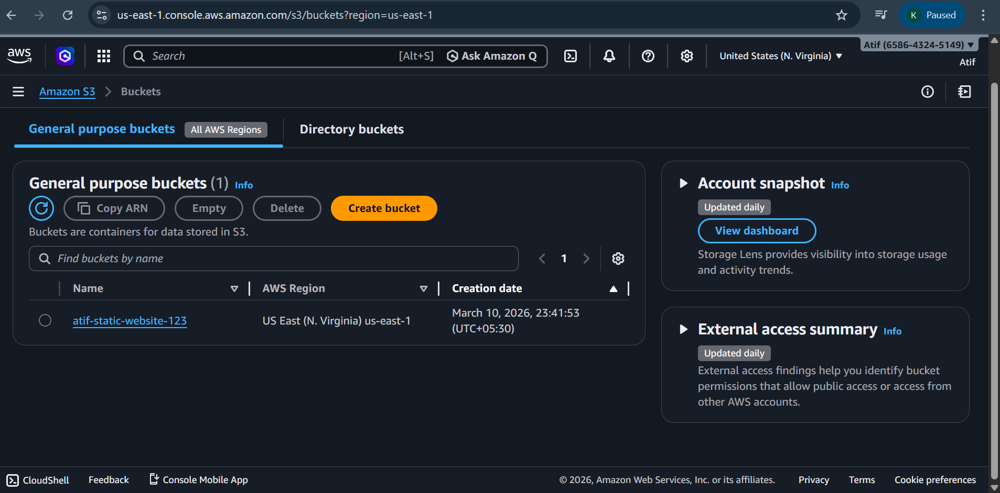
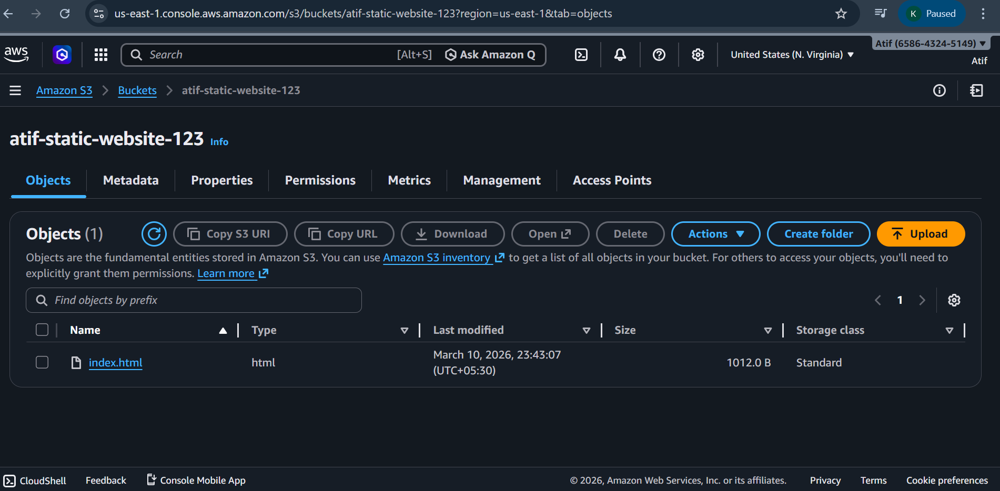
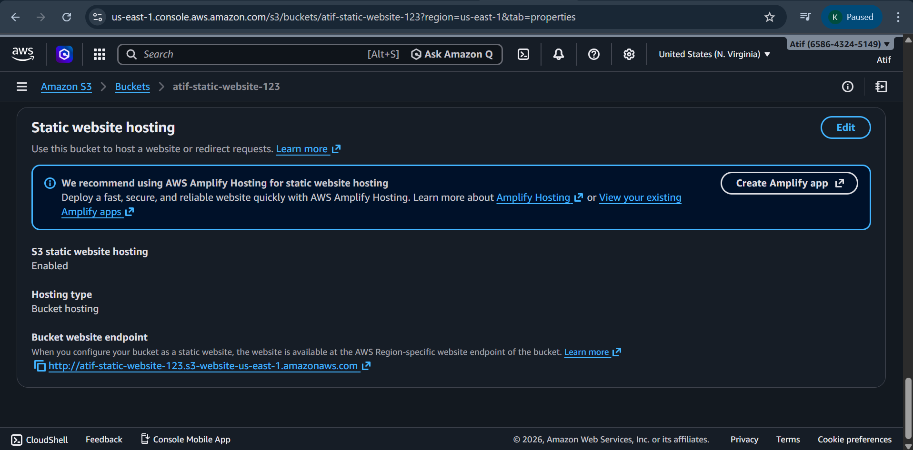
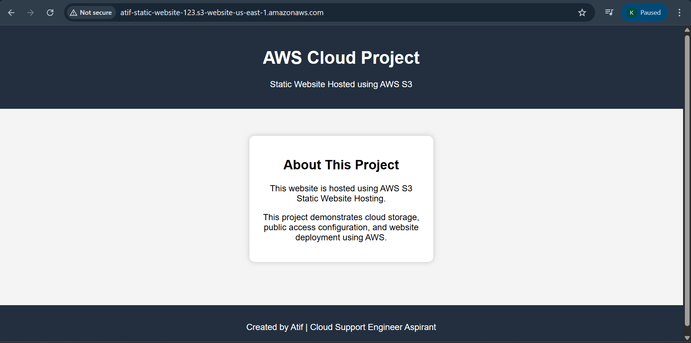

# AWS S3 Static Website Hosting Project

## Project Overview

This project demonstrates how to host a static website using Amazon S3 in Amazon Web Services (AWS).  
The website files are stored in an S3 bucket and made publicly accessible using static website hosting configuration.
This project helps understand cloud storage, public access configuration, and simple website deployment in AWS.

## Architecture
User Browser  
↓  
Amazon S3 Bucket  
↓  
Static Website Hosting Enabled  
↓  
Public Website Endpoint

## Technologies Used

- Amazon Web Services (AWS)
- Amazon S3
- HTML
- Static Website Hosting
- Cloud Storage

## Project Implementation Steps

### 1. Create S3 Bucket
- Open AWS Management Console
- Navigate to Amazon S3
- Create a new S3 bucket with a unique name

### 2. Configure Public Access
- Disabled Block Public Access settings
- Allowed public access to objects

### 3. Upload Website Files
- Created a simple website using HTML
- Uploaded `index.html` file to the S3 bucket

### 4. Enable Static Website Hosting
- Enabled Static Website Hosting in bucket properties
- Set `index.html` as the index document

### 5. Configure Bucket Policy
- Added bucket policy to allow public read access for website files

### 6. Access the Website
- Used the S3 Website Endpoint URL to access the hosted website from the browser

## Screenshots

### S3 Bucket Created

### File Upload to S3

### Static Website Hosting Enabled

### Website Running in Browser

## Key Learning Outcomes

From this project I learned:

- Creating and managing S3 buckets
- Configuring public access settings
- Hosting static websites using Amazon S3
- Uploading and managing objects in cloud storage
- Deploying a simple website in AWS

## Future Improvements

- Add CSS styling for better UI
- Deploy a multi-page website
- Use Amazon CloudFront for faster content delivery
- Configure custom domain for the website

## Author
Name: Atif  
Role: Cloud Support Engineer Aspirant
